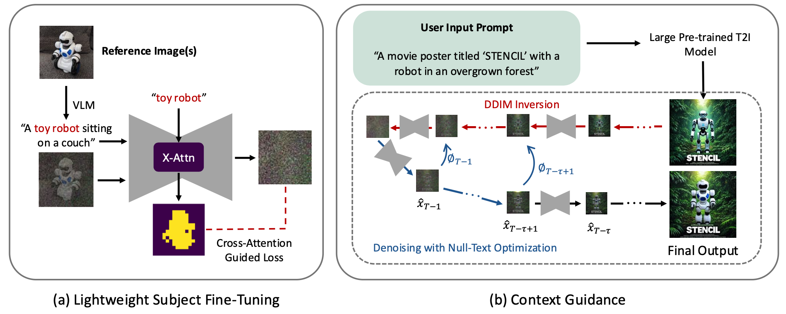

[](https://gordonchen19.github.io/STENCIL.github.io/static/pdfs/chen.pdf)
[](https://gordonchen19.github.io/STENCIL.github.io/)


<h1 align="center">STENCIL: Subject-Driven Generation with Context Guidance</h1>

<p align="center">
  <a href="https://gordonchen19.github.io">Gordon Chen</a>,
  <a href="https://ziqihuangg.github.io">Ziqi Huang</a>,
  <a href="https://www.a-star.edu.sg/cfar/about-cfar/our-team/dr-cheston-tan">Cheston Tan</a>,
  <a href="https://liuziwei7.github.io/team.html">Ziwei Liu</a>
</p>


<p align="center">
  IEEE ICIP 2025, Oral Spotlight (36 of 491)
</p>

## :mega: Overview 

Recent text-to-image diffusion models can produce impressive visuals from textual prompts, but they struggle to reproduce the same subject consistently across multiple generations or contexts. Existing fine-tuning based methods for subject-driven generation face a trade-off between quality and efficiency. Fine-tuning larger models yield higher-quality images but is computationally expensive, while fine-tuning smaller models is more efficient but compromises image quality. To this end, we present Stencil. Stencil resolves this trade-off by leveraging the superior contextual priors of large models and efficient fine-tuning of small models. Stencil uses a small model for fine-tuning while a large pre-trained model provides contextual guidance during inference, injecting rich priors into the generation process with minimal overhead. Stencil excels at generating high-fidelity, novel renditions of the subject in less than a minute, delivering state-of-the-art performance and setting a new benchmark in subject-driven generation.

> **Note:** This codebase is a work in progress. 

## Pipeline 

The diagram below shows the STENCIL pipeline, combining a small fine-tuned model for subject fidelity with a large frozen model for rich contextual priors.



(a) Cross-Attention Guided Loss. We fine-tune a lightweight text-to-image diffusion model on the reference image(s) of the subject. The Cross-Attention Guided Loss is applied so that gradients are computed only in regions influenced by the subject token (e.g. “toy robot”). (b) Context Guidance. At inference, given a user prompt, we draft an image with a large frozen text-to-image model. The draft is inverted into the latent space of the lightweight fine-tuned model and refined via null-text optimisation, producing the final image that preserves both the prompt context and the personalized subject. This allows us to generate images with rich contextual priors injected from a large diffusion model, without the computational cost of fine-tuning on the same large-scale models that are capable of producing them.

## Repository Structure

```
STENCIL/
├── main.py
├── vlm/
│   ├── extraction_chain.py
│   ├── data_models.py            # AugmentedPrompt, Image schemas
│   └── prompt_template.py        # augmented_prompt_template, caption_template
├── models/
│   ├── base_model.py
│   └── support_model.py
├── references/                   # your reference images (png/jpg)
├── static/
│   ├── Diagram.pdf
│   └── Diagram.png               # for README embedding
├── .env                          # environment variables (gitignored)
└── requirements.txt
```

## :hammer: Installation 

1. Clone the repository

```
git clone https://github.com/GordonChen19/STENCIL.git
cd STENCIL
```

2. Install the environment

```
python3 -m venv venv
source venv/bin/activate
pip install -r requirements.txt
```

---

## Usage

Create a `.env` at the project root (same folder as `main.py`):

OPENAI_API_KEY="your api key"

> No spaces around `=` and no quotes.

Inside `main.py`, define your text prompt. Define the  `image_filepath` for Image-to-Image translation (if applicable)

---

## Prepare Reference Images

Place one or more images into:

Put a few images into `STENCIL/references/`

---

## :rocket: Run

```bash
python main.py
```

## :relaxed: Citation
If you find our repo useful for your research, consider citing our paper:

```
@inproceedings{chen2025stencil,
  author    = {Gordon Chen and Ziqi Huang and Cheston Tan and Ziwei Liu},
  title     = {STENCIL: Subject-Driven Generation with Context Guidance},
  booktitle = {Proceedings of the IEEE International Conference on Image Processing (ICIP)},
  year      = {2025},
  note      = {Accepted as Spotlight paper},
}
```